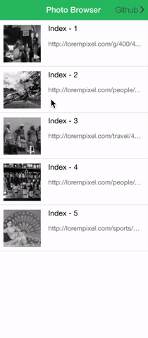

### DEMO (codepen)



* Simple http://codepen.io/kevincobain2000/pen/LpBKQM
* With captions http://codepen.io/kevincobain2000/pen/OMRYNv

## How TO

### Add in your index.html

```
<!-- THE ADDITION -->
<link rel="stylesheet" type="text/css" href="https://rawgit.com/nolimits4web/Framework7/master/dist/css/framework7.ios.css">
<script src="https://rawgit.com/nolimits4web/Framework7/master/dist/js/framework7.js"></script>
<!-- ENDS -->
```

#### HTML

```
<ion-list>
  <ion-item class="item item-thumbnail-left" ng-repeat="image in images" ng-click="photoBrowser($index)">
    
    <h2>Index - {{$index}}</h2>
    <p>{{image}}</p>
  </ion-item>
</ion-list>
```

#### In your controller

```
.controller('AppCtrl', function($scope, $timeout, $ionicPopup) {
   $scope.images = [       
                        'http://lorempixel.com/g/400/400/'
                      , 'http://lorempixel.com/people/400/400/'
                      , 'http://lorempixel.com/travel/400/400/'
                      , 'http://lorempixel.com/people/200/200/'
                      , 'http://lorempixel.com/sports/200/200/'
                    ]
   
  $scope.photoBrowser = photoBrowser;

  function photoBrowser(index){
    photoBrowserStandalone(index, $scope.images)
  }

  function photoBrowserStandalone(index, images){
    var myApp = new Framework7({
        init: false, //IMPORTANT - just do it, will write about why it needs to false later
    });
    var myPhotoBrowserStandalone = myApp.photoBrowser({
        type: 'standalone',
        theme: 'light',
        photos : images,
        initialSlide: index,
        onClose: function(){
          myApp = undefined;
        }
    });
    myPhotoBrowserStandalone.open();
  }

});
```


#### Files & Docs

https://github.com/nolimits4web/framework7/
